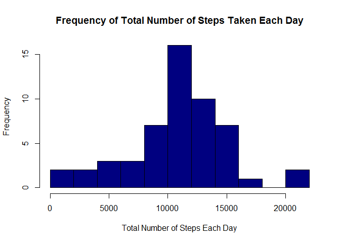
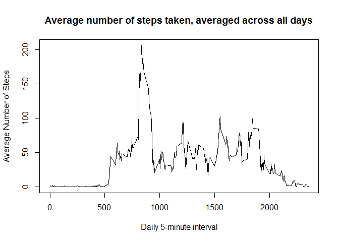
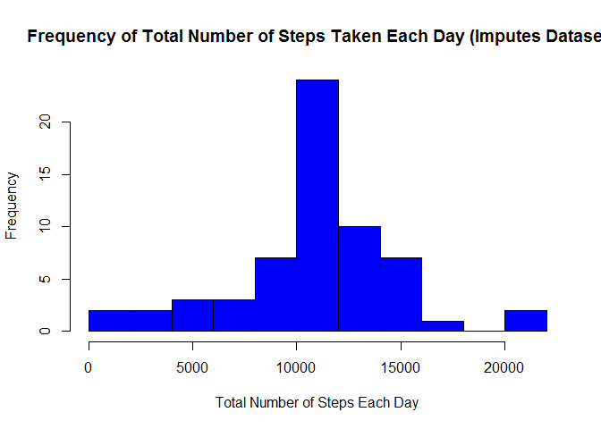
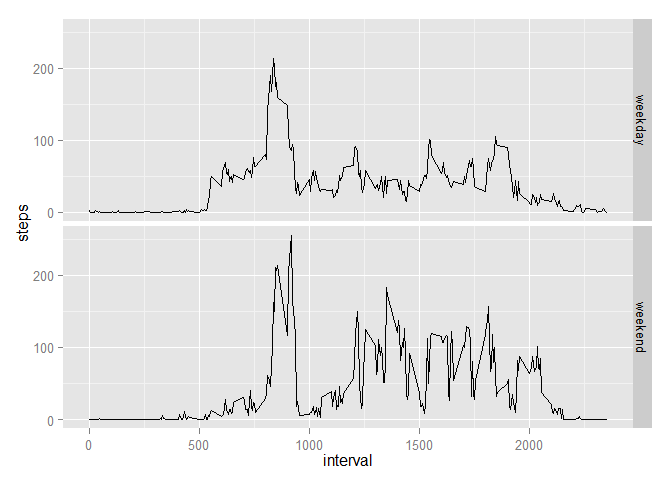

# Reproducible Research: Peer Assessment 1
Gayatri Kanthimathi Sukumar  
Monday, January 12, 2015  

##Introduction: 
This is my solution to the Peer Assignment 1 of the Coursera Reproducible 
Research offered by Johns Hopkins Bloomberg School of Public Health.

##Data Source: 
This assignment makes use of [data from a personal activity](https://d396qusza40orc.cloudfront.net/repdata%2Fdata%2Factivity.zip) monitoring device. This device collects data at 5 minute intervals through out the day. The data consists of two months of data from an anonymous individual collected during the months of October and November, 2012 and include the number of steps taken in 5 minute intervals each day.


The variables included in this dataset are:
* steps: Number of steps taking in a 5-minute interval (missing values are coded as NA)
* date: The date on which the measurement was taken in YYYY-MM-DD format
* interval: Identifier for the 5-minute interval in which measurement was taken

##Assignment Questions with Solutions:


###Loading and preprocessing the data
####Question
Show any code that is needed to

1. Load the data (i.e. read.csv())
2. Process/transform the data (if necessary) into a format suitable for your analysis

####Solution

1. Load the data (i.e. read.csv())

The below code loads the activity.csv file as activityDF data frame. We will also
inspect the variables in this data and their types.


```r
activityDF = read.csv("./activity/activity.csv", sep = ",")
str(activityDF)
```

```
## 'data.frame':	17568 obs. of  3 variables:
##  $ steps   : int  NA NA NA NA NA NA NA NA NA NA ...
##  $ date    : Factor w/ 61 levels "2012-10-01","2012-10-02",..: 1 1 1 1 1 1 1 1 1 1 ...
##  $ interval: int  0 5 10 15 20 25 30 35 40 45 ...
```

2. Process/transform the data (if necessary) into a format suitable for your analysis

From the above result, we observe that the date variable is stored as a factor variable. Let us convert date from factor to R date type and view the variable types again.


```r
activityDF$date = as.Date (activityDF$date, format = "%Y-%m-%d")
str(activityDF)
```

```
## 'data.frame':	17568 obs. of  3 variables:
##  $ steps   : int  NA NA NA NA NA NA NA NA NA NA ...
##  $ date    : Date, format: "2012-10-01" "2012-10-01" ...
##  $ interval: int  0 5 10 15 20 25 30 35 40 45 ...
```

###What is mean total number of steps taken per day?
####Question
For this part of the assignment, you can ignore the missing values in the dataset.

1. Make a histogram of the total number of steps taken each day
2. Calculate and report the mean and median total number of steps taken per day

####Solution

1. Make a histogram of the total number of steps taken each day

Let us make a histogram of the total number of steps taken each day with the
below R code.


```r
dayWiseTotalSteps = tapply (activityDF$steps, as.factor (activityDF$date), sum)
hist (dayWiseTotalSteps, main = "Frequency of Total Number of Steps Taken Each Day", xlab = "Total Number of Steps Each Day", ylab = "Frequency", col = "navy blue", breaks = 10)
```

 

2. Calculate and report the mean and median total number of steps taken per day

Let us calculate the mean and median of the total number of steps taken per day.


```r
meanStepsPerDay = mean (dayWiseTotalSteps, na.rm = TRUE)
medianStepsPerDay = median (dayWiseTotalSteps, na.rm = TRUE)
meanStepsPerDay
```

```
## [1] 10766.19
```

```r
medianStepsPerDay
```

```
## [1] 10765
```

As per the above, the mean and median of the total number of steps taken per day are 1.0766189\times 10^{4} and 10765 respectively.

###What is the average daily activity pattern?
####Question

1. Make a time series plot (i.e. type = "l") of the 5-minute interval (x-axis) and the average number of steps taken, averaged across all days (y-axis)

2. Which 5-minute interval, on average across all the days in the dataset, contains the maximum number of steps?

####Solution

1. Make a time series plot (i.e. type = "l") of the 5-minute interval (x-axis) and the average number of steps taken, averaged across all days (y-axis)


```r
avgStepsIntervalWise = tapply (activityDF$steps, as.factor (activityDF$interval), mean, na.rm = TRUE)
plot (as.numeric (row.names (avgStepsIntervalWise)), avgStepsIntervalWise, type = 'l', xlab = "Daily 5-minute interval", ylab = "Average Number of Steps", main = "Average number of steps taken, averaged across all days")
```

 

2. Which 5-minute interval, on average across all the days in the dataset, contains the maximum number of steps?


```r
intervalWithHighestSteps = names (which.max (avgStepsIntervalWise))
View(intervalWithHighestSteps)
```

From the above calculation, the interval with the highest average steps is 835.

###Imputing missing values
####Question
Note that there are a number of days/intervals where there are missing values (coded as NA). The presence of missing days may introduce bias into some calculations or summaries of the data.

1. Calculate and report the total number of missing values in the dataset (i.e. the total number of rows with NAs)

2. Devise a strategy for filling in all of the missing values in the dataset. The strategy does not need to be sophisticated. For example, you could use the mean/median for that day, or the mean for that 5-minute interval, etc.

3. Create a new dataset that is equal to the original dataset but with the missing data filled in.

4. Make a histogram of the total number of steps taken each day and Calculate and report the mean and median total number of steps taken per day. Do these values differ from the estimates from the first part of the assignment? What is the impact of imputing missing data on the estimates of the total daily number of steps?

####Solution

1. Calculate and report the total number of missing values in the dataset (i.e. the total number of rows with NAs)


```r
totalRowsWithNAs = sum(is.na(activityDF))
View(totalRowsWithNAs)
```

From the above calculation, the total number of rows with NA are 2304.

2. Devise a strategy for filling in all of the missing values in the dataset. The strategy does not need to be sophisticated. For example, you could use the mean/median for that day, or the mean for that 5-minute interval, etc.

Strategy: Here we are going to impute the missing values with the average across all days for that particular interval. We are choosing to do it this way rather than use the overall mean / median as the number of steps through the day across intervals varies by and large from the previous plot. We will also be rounding of the steps as steps cannot have decimal values.

3. Create a new dataset that is equal to the original dataset but with the missing data filled in.

The new dataset created below 'imputedActivityDF' has the missing values imputed as per the above strategy. 


```r
imputedActivityDF = activityDF

for (i in 1:nrow (imputedActivityDF)) 
{
    if (is.na (imputedActivityDF$steps[i])) 
    {
        imputedActivityDF$steps[i] = 
            round (avgStepsIntervalWise [names(avgStepsIntervalWise) == as.character(imputedActivityDF$interval[i])])
    }
}

str (imputedActivityDF)
```

```
## 'data.frame':	17568 obs. of  3 variables:
##  $ steps   : num  2 0 0 0 0 2 1 1 0 1 ...
##  $ date    : Date, format: "2012-10-01" "2012-10-01" ...
##  $ interval: int  0 5 10 15 20 25 30 35 40 45 ...
```

```r
sum(is.na(imputedActivityDF))
```

```
## [1] 0
```

We can also observe that in the new dataset, there are no missing values.

4. Make a histogram of the total number of steps taken each day and Calculate and report the mean and median total number of steps taken per day. Do these values differ from the estimates from the first part of the assignment? What is the impact of imputing missing data on the estimates of the total daily number of steps?

Let us redo the histogram, mean and median with the new imputed dataset.


```r
imputedDayWiseTotalSteps = tapply (imputedActivityDF$steps, as.factor (imputedActivityDF$date), sum)
hist (imputedDayWiseTotalSteps, main = "Frequency of Total Number of Steps Taken Each Day (Imputes Dataset", xlab = "Total Number of Steps Each Day", ylab = "Frequency", col = "blue", breaks = 10)
```

 

Let us calculate the mean and median of the total number of steps taken per day on the imputed dataset.


```r
imputedMeanStepsPerDay = mean (imputedDayWiseTotalSteps, na.rm = TRUE)
imputedMedianStepsPerDay = median (imputedDayWiseTotalSteps, na.rm = TRUE)
imputedMeanStepsPerDay
```

```
## [1] 10765.64
```

```r
imputedMedianStepsPerDay
```

```
## [1] 10762
```

From the above, there appears to be **no impact or extremely negligible impact** on the estimates of the total daily number of steps on imputing the missing values with interval mean.

###Are there differences in activity patterns between weekdays and weekends?
####Question
For this part the weekdays() function may be of some help here. Use the dataset with the filled-in missing values for this part.

1. Create a new factor variable in the dataset with two levels - "weekday" and "weekend" indicating whether a given date is a weekday or weekend day.

2. Make a panel plot containing a time series plot (i.e. type = "l") of the 5-minute interval (x-axis) and the average number of steps taken, averaged across all weekday days or weekend days (y-axis). See the README file in the GitHub repository to see an example of what this plot should look like using simulated data.

####Solution

1. Create a new factor variable in the dataset with two levels - "weekday" and "weekend" indicating whether a given date is a weekday or weekend day.

The way that we are doing this is to use the date and find if wday is 6 or 7. wday being 6 implies Saturday and 7 implies Sunday. The new factor variable is 'dayType'.


```r
imputedActivityDF$dayType = ifelse(((as.POSIXlt(imputedActivityDF$date)$wday == 6) | (as.POSIXlt(imputedActivityDF$date)$wday == 7)), "weekend", "weekday")
imputedActivityDF$dayType = as.factor(imputedActivityDF$dayType)
str(imputedActivityDF)
```

```
## 'data.frame':	17568 obs. of  4 variables:
##  $ steps   : num  2 0 0 0 0 2 1 1 0 1 ...
##  $ date    : Date, format: "2012-10-01" "2012-10-01" ...
##  $ interval: int  0 5 10 15 20 25 30 35 40 45 ...
##  $ dayType : Factor w/ 2 levels "weekday","weekend": 1 1 1 1 1 1 1 1 1 1 ...
```

From the above we observe that the new factor variable is created as required.

2. Make a panel plot containing a time series plot (i.e. type = "l") of the 5-minute interval (x-axis) and the average number of steps taken, averaged across all weekday days or weekend days (y-axis). See the README file in the GitHub repository to see an example of what this plot should look like using simulated data.


```r
avgSteps = aggregate (steps ~ interval + dayType, data = imputedActivityDF, mean)
str (avgSteps)
```

```
## 'data.frame':	576 obs. of  3 variables:
##  $ interval: int  0 5 10 15 20 25 30 35 40 45 ...
##  $ dayType : Factor w/ 2 levels "weekday","weekend": 1 1 1 1 1 1 1 1 1 1 ...
##  $ steps   : num  1.9811 0.3396 0.1321 0.1509 0.0755 ...
```

```r
library(ggplot2)
```

```
## Warning: package 'ggplot2' was built under R version 3.1.2
```

```r
qplot (interval, steps, data = avgSteps, facets = dayType~. , geom = "line")
```

 

From the above plot, it is very clear that **there certainly are differences in activity patterns between weekdays and weekends**, with the activity being higher during weekends.
